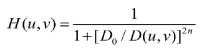
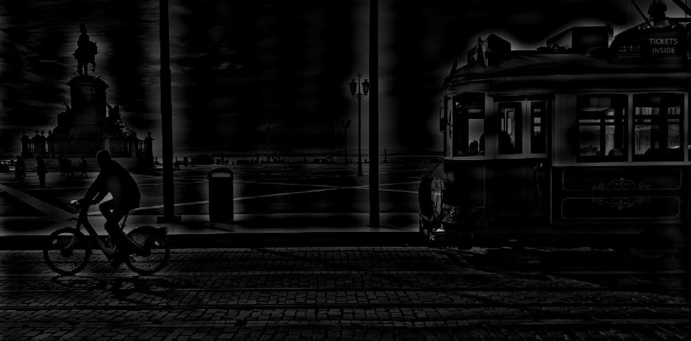

# Exercise 1

#### 👨‍🎓 This project was carried out during my master's degree in computer vision at URJC - Madrid

Construct a Butterworth high-pass filter of order n (2D).
Filter an image in the domain of a given frequency.

## Goals

- Construct a Butterworth high-pass filter
- Filter an image in the domain of a given frequency

<p align="center">
  
</p>
<p align="center">
  <i>Formula of Butterworth (high-pass filter)</i> #TODO
</p>

## Requirements

* Matlab

## Usage

Run ```main.m``` with matlab

###### For more explanations see ```Explanation-esp.pdf``` (spanish version)

## Results

<p align="center">
  
</p>
<p align="center">
  <i>Original image</i>
</p>

<p align="center">
  
</p>
<p align="center">
  <i>Result with n = 100 and D0 = 90</i>
</p>

<p align="center">
  
</p>
<p align="center">
  <i>Result with n = 100 and D0 = 15</i>
</p>

## Structure

    .
    ├── imgs
    │    ├── formula.png
    │    ├── result1.png
    │    ├── result2.png
    │    └── result.png
    ├── Lisboa.png
    ├── main.m
    ├── Memoria 1.pdf
    ├── README.md
    └── results
        └── *.jpg

## Authors

* **Luis Rosario** - *Initial work* - [Luisrosario2604](https://github.com/Luisrosario2604)