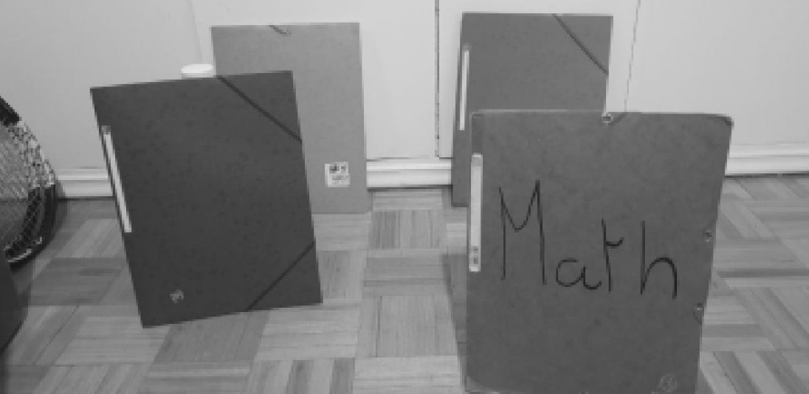
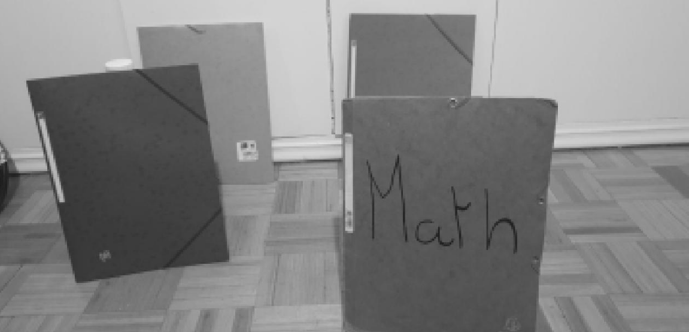
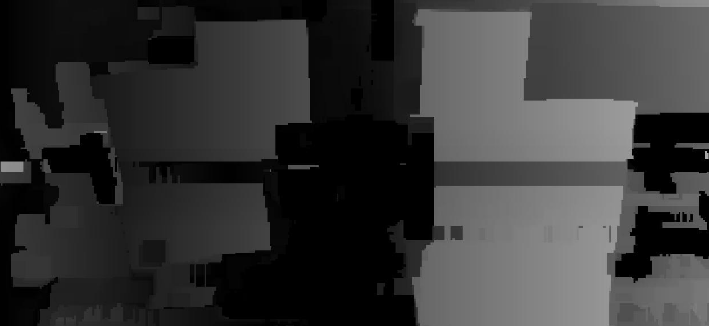
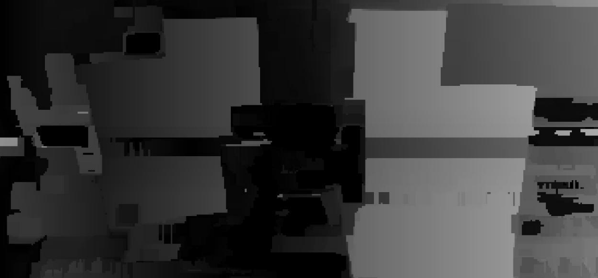

# Exercise 3

#### 👨‍🎓 This project was carried out during my master's degree in computer vision at URJC - Madrid

Calculate the disparity map between two images (stereo pair).
Use the block fitting technique, with a block size of your choice (11x11 is a typical size).
Represent the result as a greyscale image.

## Goals

- Calculate the disparity map between two images
- Use the block fitting technique
- Represent the result as a greyscale image

## Requirements

* Matlab

## Usage

Run ```main.m``` with matlab

###### For more explanations see ```Explanation-esp.pdf``` (spanish version)

## Results

<p align="center">
  
</p>
<p align="center">
  <i>Original left image</i>
</p>

<p align="center">
  
</p>
<p align="center">
  <i>Original right image</i>
</p>

<p align="center">
  
</p>
<p align="center">
  <i>Result with threshold = 2</i>
</p>

<p align="center">
  
</p>
<p align="center">
  <i>Result with threshold = 1000</i>
</p>

## Structure

    .
    ├── data
    │   └── *.png
    ├── Explanation-esp.pdf
    ├── imgs
    │    ├── result1.png
    │    ├── result2.png
    │    ├── result3.png
    │    └── result.png
    ├── main.m
    ├── README.md
    └── results
        └── *.jpg

## Authors

* **Luis Rosario** - *Member 1* - [Luisrosario2604](https://github.com/Luisrosario2604)