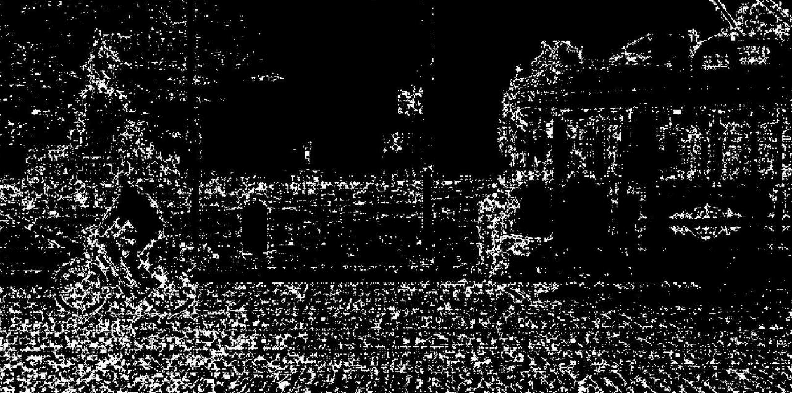
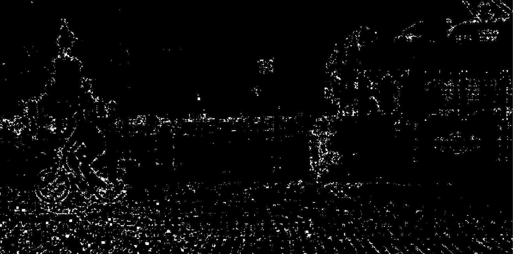
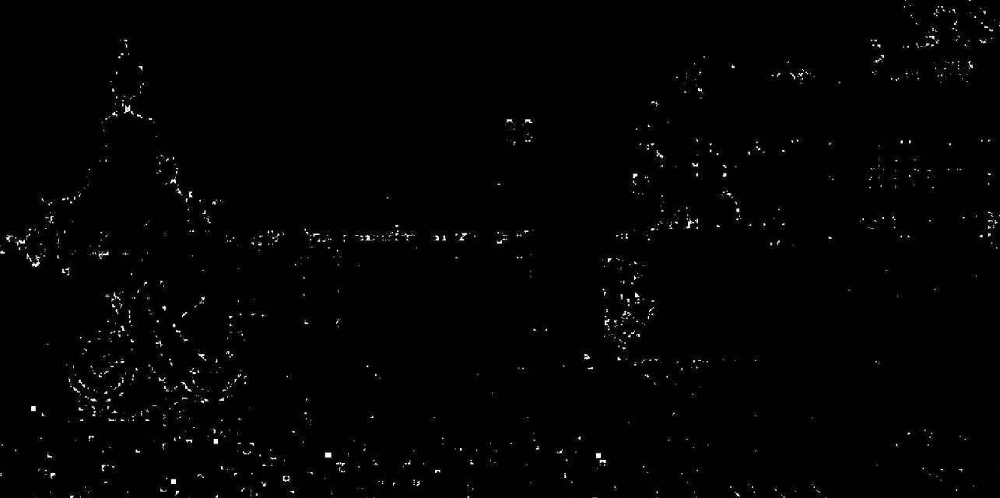

# Exercise 4

#### 👨‍🎓 This project was carried out during my master's degree in computer vision at URJC - Madrid

Uses the combinations of mathematical morphology operations for corner detection in greyscale images.
You can use as many of the previous operations as you see fit.

## Goals

- Detect corners in greyscale

## Requirements

* Matlab

## Usage

Run ```main.m``` with matlab

###### For more explanations see ```Explanation-esp.pdf``` (spanish version)

## Results

<p align="center">
  
</p>
<p align="center">
  <i>Original image</i>
</p>

<p align="center">
  
</p>
<p align="center">
  <i>Result with threshold = 2</i>
</p>

<p align="center">
  
</p>
<p align="center">
  <i>Result with threshold = 8</i>
</p>

<p align="center">
  
</p>
<p align="center">
  <i>Result with threshold = 18</i>
</p>

## Structure

    .
    ├── Explanation-esp.pdf
    ├── imgs
    │    ├── result1.png
    │    ├── result2.png
    │    ├── result3.png
    │    └── result.png
    ├── Lisboa.png
    ├── main.m
    ├── README.md
    └── results
        ├── thresh18.jpg
        ├── thresh2.jpg
        └── tresh8.jpg

## Authors

* **Luis Rosario** - *Initial work* - [Luisrosario2604](https://github.com/Luisrosario2604)